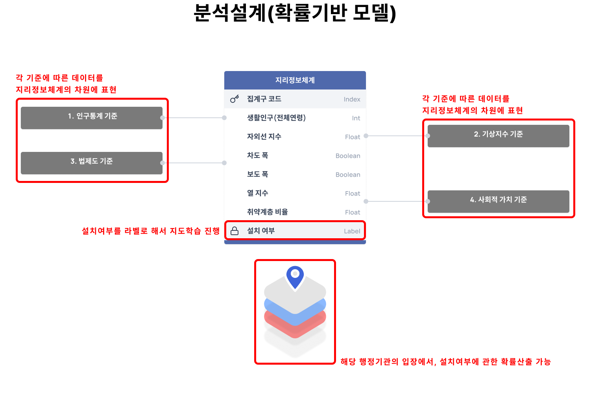
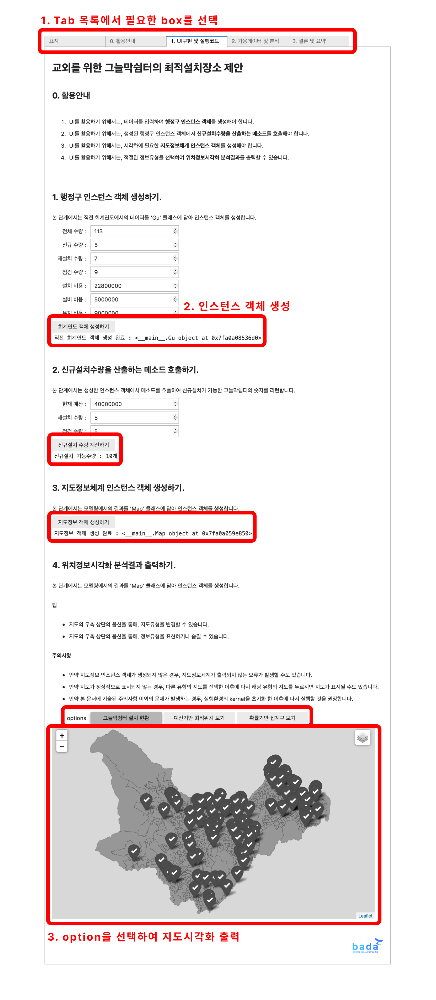

# 폭염취약계층을 위한 그늘막쉼터에 대해, 로지스틱 회귀를 활용한, 최적의 입지장소 제안

 

 
 

## 1. 프로젝트 배경 및 목적

'문제를 해결하고, 부가가치를 더하자.' 이 문구는 본 연구의 주제로서 아이디어를 발굴
하기 위해 설정한 가치기준입니다. 이러한 관점에서 살펴보자면, 이번 여름에 서울의 한
낮 기온이 35도까지 치솟으면서 수많은 학우들이 무더위로 인한 불편함을 겪고 있었습니
다. 그리고 이 뿐만 아니라, 내리쬐는 강한 햇볕으로 인해 자외선 지수가 '매우 높음'의 단
계에 이르러서 성북구에 거주하는 주민들의 야외활동을 위험하게 하고 있습니다. 그런데
이것을 단순히 여름이라는 계절적 요인으로만 치부하기에는, 폭염과 강한 햇볕 문제는
매년 수많은 사람을 곤란하게 하고 있었습니다. 이러한 의문에서 시작해서, 이 문제를 해결
할 수 있는 솔루션을 고안하여, 고려대학교 교내와 성북구이라는 지역을 기반으로 사회
적 가치를 창출하고, 고려대학교 학우와 성북구 주민 모두에게 공익을 제공하는 아이디
어에 도전해보고 싶다고 생각하게 되었습니다. 그리하여, 이러한 관점에서 접근해서 새
로운 문제를 정의하였고 이를 창의적인 방법으로 해결하여 부가가치를 더하고자 합니다.
따라서, 지역기반의 사회적 가치창출과 공공의 복지실현이라는 목적을 달성하기 위하여,
외부에서 획득한 데이터와 직접 수집한 데이터를 활용하고 여러 인공지능 기법을 다면적
으로 적용하여, 아래의 그림과 같이 고려대학교의 학우와 성북구의 주민을 위한 그늘막
쉼터의 최적설치장소를 제안하고자 합니다.

 

## 2. 프로젝트 내용 

 

### 2.1 활용 데이터셋
가. 성북구청 제공 데이터(정보공개법에 따른 정보공개청구제도 활용)
1) 서울특별시 성북구 그늘막 설치 현황 (2022. 07. 기준)
2) 서울특별시 성북구 2022년 폭염저감시설(그늘막) 설치 및 운영 계획
3) 서울특별시 성북구 그늘막 설치·관리 지침 개정(2021.4.2.)
나. 디지털정보처 제공 데이터
1) 개설과목 관련 데이터
2) 랜드마크와 라운지 데이터
다. 공공데이터포털 제공 데이터
1) 기상청_생활기상지수 조회서비스(3.0) API
2) 서울특별시_서울시 대로변 횡단보도 위치정보
3) 서울시 도로노선 정보
4) 서울시 보도 정보(서울시의 DB 개선작업으로 22년 말까지 제공 중단)
라. 서울열린데이터광장 제공 데이터
1) 집계구 단위 서울 생활인구(내국인)
마. 통계지리정보서비스 제공 데이터
1) 2021년 집계구경계 shape 데이터

### 2.2 프로젝트 설계

 

### 2.3 프로젝트 결론

본 분석아이디어는 행정기관이나 시설관리팀과 같은 의사결정자를 타겟팅하고 있으므
로, 이를 고려할 때 화려한 UI보다는 상황에 따라 적절하고 유연하게 활용될 수 있도록 여
러 옵션을 가지고 있는 UI가 가장 적절하다고 판단했습니다. 이러한 판단에 따라, 분석내
용 및 분석결과를 아래의 <그림>과 같이 ,ipynb 파일로 작성된 개념증명서에서
dashboard 형태의 UI를 구현할 수 있었습니다.

우선 교외를 위한 그늘막쉼터 모델링에 따르면, 아래의 그림과 같이 설치현황, 예산기반
모델, 확률기반 모델로 시각화를 진행하였습니다. 설치현황에 따르면, 현재 성북구청에
설치된 그늘막쉼터의 위치를 회색 마커로 나타내서 시각화할 수 있었습니다. 예산기반
모델에 따르면, 로지스틱회귀 모델링에 따라 확률로 출력된 집계구 배열을 내림차순으로
정렬한 뒤 신규설치수량만큼 슬라이싱하여 그 결과를 보여줍니다. 확률기반 모델에 따르
면, 집계구별로 산출된 확률을 시각화하여 나타냅니다.

다음으로 교내를 위한 그늘막쉼터 모델링에 따르면, 아래의 그림과 같이 설문조사 자료
와 데이터시각화를 통해 해석할 수 있었습니다. 156명을 대상으로 진행한 설문조사 결과
에 따르면, 대부분의 학생들이 교내에 위한 그늘막벤치를 사용하는 이유는 “실내공간으
로부터 기분을 환기하기 위해서”라는 응답이 가장 많았습니다. 이를 근거로 그늘막벤치
가 건물 주변에 위치하도록 하되, 실내휴게공간이 부족한 건물에 우선적으로 배치해야
한다고 판단할 수 있었습니다. 이를 위해, 디지털정보처에서 제공받은 라운지 데이터와
수강인원 데이터를 활용하여, 실내휴게공간 대비 수강인원 비율을 산출할 수 있었습니
다. 그리고 이를 시계열-위치정보시각화 분석으로 표현할 수 있었습니다. 이에 따르면, 3
교시가 시작하는 12시 무렵에는 교육관이 비교적으로 실내휴게공간 대비 수강인원이 많다는 사실을 발견할 수 있었으며, 교내를 위한 그늘막벤치의 입지로 주목할 수 있었습니
다.

 

### 2.4 프로젝트를 통한 기대효과

#### (1) 여름철 무더위에 대비한, 안전시설물로서의 기대효과

본 분석아이디어에서 주로 다루는 그늘막쉼터는 여름철 무더위의 위험성에 대비하는
안전시설물로서 기능할 수 있습니다. 이는 그늘막쉼터가 적재적소에 설치되어 있어, 지
역주민이 일상 속에서 쾌적하게 활동할 수 있도록 하기 때문입니다. 이 뿐만 아니라, 특히
무더위 취약계층(영유아, 만65세 이상 고령자 등)이 대로변에서 강한 햇볕에 장시간 노출
되어 온열질환을 발생하는 심각한 위험을 피할 수 있습니다.

#### (2) 다른 시설물의 설치계획에서, 보조지표로서의 활용가능성

본 분석아이디어를 설계하는 과정에서, 예산기반 모델링을 구현할 수 있었는데, 이 덕분
에 과거의 설치계획 데이터와 차기연도의 예산총액 데이터로 시설물의 신규설치수량을
간편하게 산출할 수 있었습니다. 이러한 개념을 추후에 다른 시설물의 설치 계획에도 활
용한다면, 행정기관이 신속하고 간편하게 예산의 범위 내에서 데이터분석에 근거한 의사
결정을 하는 것이 가능해질 것으로 기대할 수 있습니다. 이 뿐만 아니라, 취약계층을 고려
한 그늘막쉼터의 위치정보는 취약계층을 위한 새로운 행정정책을 계획할 때도 큰 도움을
줄 수 있을 것으로 기대하고 있습니다.

#### (3) 전국의 그늘막쉼터 설치계획에서, 다른 행정구역으로의 확장가능성

본 분석아이디어를 설계하는 과정에서, API를 활용하여 파이프라인과 같은 구조로 모델
링을 구현할 수 있었는데, 이 덕분에 지역코드 설정만 변경하면 간편하게 다른 행정구역
의 모델링 결과를 산출할 수 있었습니다. 이를 확장하여 추후에 다른 행정구역의 설치 계
획에도 적극적으로 활용한다면, 성북구청 뿐만 아니라 다른 행정기관에서도 신속하고 간
편하게 데이터분석에 근거한 의사결정을 하는 것이 가능해질 것으로 기대할 수 있습니
다.

 

### 프로젝트를 통한 사회적 가치 도출 효과

본 아이디어가 창출하는 사회적 가치 도출 효과를 논하자면, 미시적으로는 지역주민의
보건복지 개선이라는 측면이 있고, 거시적으로는 행정구역 간 지역격차 해소가 있습니
다.
우선, 미시적 측면에 주목하자면, 본 아이디어는 지역주민의 보건복지 개선에 기여할 수
있습니다. 그늘막쉼터는 실제온도를 2도 정도 낮출 수 있으며 체감온도는 수십도 정도를
낮출 수 있습니다. 이는 폭염과 무더위로 인한 온열질환을 예방하여 지역주민 보건복지
에 기여하여 사회적 가치를 실현할 수 있습니다.
다음으로, 거시적 측면에 주목하자면, 본 아이디어는 행정구역 간 지역격차 해소에 기여
할 수 있습니다. 본 아이디어를 위해 구현된 UI에 따르면, 그늘막쉼터 설치수량은 행정동
사이에서 뿐만 아니라 집계구 사이에서도 큰 차이가 나타났습니다. 이러한 정보를 고려
한다면, 추후에 행정기관이 정책을 집행을 입안할 때 행정구역 간의 격차를 해소하는 방
안으로 사회적 가치를 실현할 수 있습니다.

 
 

## 3. 프로젝트를 마치며

분석과제를 수행할 때, 기존의 경우에는 이미 생성되어 있는 자료만을 활용했던 반면에,
이번 데이터톤에서는 각종 기관을 통해 수집된 1차적 데이터를 직접 목적에 맞게 가공하
고 정제하는 과정을 경험할 수 있었습니다. 이러한 경험 덕분에, 분석에 필요한 역량이 단
순히 통계적 지식 혹은 코딩과 같은 기술적인 측면에만 국한되는 것이 아니라는 것을 깨
달을 수 있었습니다. 뿐만 아니라, 사회적 가치를 창출하는 아이디어를 실현하기 위해서
는, 자료를 수집하고 그를 가공하고 이를 계획해나가는 과정에서, 끊임없이 외부적 요소
를 고려하고 확증편향에 빠지지 않게 객관성을 고민해야 한다는 점을, 이번 데이터톤을
통해 실감할 수 있었습니다. 특히, 데이터 사이언티스트 선생님의 조언을 통해, 발제에서
의 참여자들과 함께 고민하고 서로에게 창의적인 영감을 줄 수 있었다는 점도, 이번 데이
터톤에서의 가장 큰 수확 중 하나였다고 생각하고 있습니다.

# Concept

1. Accouning Based Model

 

2. Probability Based Model
   
    

# How to Use

 
